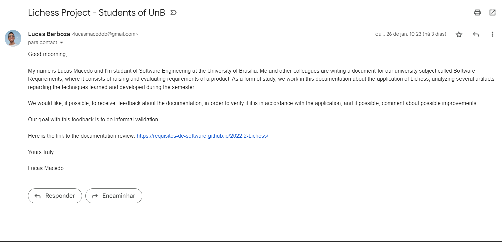

# Validação

## Introdução
A validação tem como objetivo a confirmação que um produto é aquele que o usuário deseja e ocorre normalmente durante o ciclo de vida [1]. Segundo o CMMI, a validação tem o objetivo de demonstrar que o produto ou componente do produto cumpre o uso pretendido quando colocado em seu ambiente desejado [2]. Ou seja, analisa se o produto atende as necessidades dos stakeholders, partes interessadas. A validação pode ser feita com a utilização de várias estratégias propostas pela literatura, algumas delas podem ser aplicadas à elicitação de requisitos, as que se sobressaem nesse contexto são as de Comprovação informal, Prototipagem e Baseada em Ponto de Vista[1].

## Comprovação Informal
Na validação nesse caso é uma tarefa de leitura de descrições em linguagem natural onde há o uso de clientes para identificar problemas nas expressões dos requisitos, sem o apoio automatizado e possuindo a dependência das habilidades analíticas dos leitores [1]. Diante disso, a comprovação informal será realizada por meio do envio de um e-mail para a comunidade de software livre da plataforma do Lichess.

## Email 

A baixo é possível observar na Figura 1 o e-mail enviado pelo grupo 2 da disciplina de Requisitos de Software à comunidade de software livre do Lichess. Até o momento da criação deste artefato, o grupo ainda nao obteve resposta da equipe de desenvolvedores.

 Figura 1: E-mail enviado à comunidade de software livre do Lichess (Fonte: autor, 2023).

<!--

 Figura 2: E-mail de resposta recebido pela equipe advindo da comunidade de software livre do Lichess (Fonte: autor, 2023).

 -->

## Bibliografia

[1] REQUISITOS – Aula 23. [S. l.]. Disponível em: https://aprender3.unb.br/pluginfile.php/2307566/mod_resource/content/2/Requisitos%20-%20Aula%20023.pdf. Acesso em: 29 jan. 2023.

[2] Gerência e Qualidade de Software - Aula 05 - Verificação e Validação – UNIVESP. Disponível em: https://www.youtube.com/watch?v=1Y-1zz6rZxo&t=22s&ab_channel=UNIVESP. Acesso em: 29, jan. 2023.

## Histórico de Versão

| Versão | Data       | Descrição            | Autor(es)     | Revisor(es) |
| ------ | ---------- | -------------------- | ------------- | ----------- |
| `1.0`  | 29/01/2023 | Criação do Documento | Lucas Gabriel |  Lucas Macedo           |