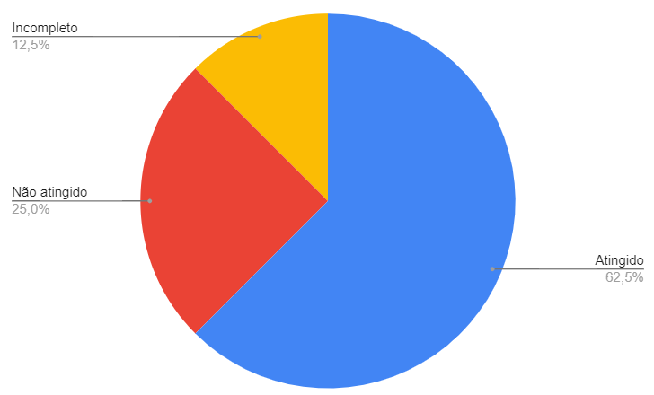

# Verificação - Introspecção

## Introdução

Segundo o CMMI, a verificação busca garantir que os produtos de trabalho selecionados cumpram os seus requisitos especificados [1]. Por tanto, nessa etapa será realizada a verificação do artefato Introspecção feito pelo Grupo 2 (MEI - Microempreendedor Individual), com intuito de analisar se esse modelo está de acordo com o que se espera dele [2].

## Metodologia

A metodologia utilizada foi a inspeção validando-se de uma lista de requisitos para checagem (check list) com o intuito de descobrir defeitos no documento e assim verificar se o modelo está de acordo com a notação do modelo e com o que se espera desse modelo [2].

## Rastreabilidade

O artefato de Introspecção pode ser consultado nesse [link](https://requisitos-de-software.github.io/2022.2-MEI/Elicitacao/Introspeccao/). Avaliação realizada na versão 1.1.

## Checklist

O checklist utilizado e a inspeção realizada podem ser observados na Tabela 1.

| Identificador | Questão                                                                         | Resposta (Sim / Não / Incompleto) | Comentário                         |
| ------------- | ------------------------------------------------------------------------------- | --------------------------------- | ---------------------------------- |
| 01            | O artefato possui uma introdução ?                                              | Sim                               |                                    |
| 02            | As tabelas do artefato possuem legenda e fonte e são chamadas no texto ?        | Não                               |                                    |
| 03            | O artefato apresenta referências bibliográficas ?                               | Não                               |                                    |
| 04            | O artefato possui histórico de versão padronizado com autor(es) e revisor(es) ? | Sim                               |                                    |
| 05            | O artefato possui explicação do método de introspecção ?                        | Sim                               |                                    |
| 06            | O artefato possui os cenários de uso identificados pelo avaliador ?             | Sim                               |                                    |
| 07            | O artefato possui os requisitos elicitados a partir da introspecção ?           | Sim                               |                                    |
| 08            | Os requisitos elicitados são verificáveis ?                                     | Incompleto                        | O requisito IS06 não é verificável |

 Tabela 1: Checklist do artefato Introspecção (Fonte: autor, 2023).

O gráfico a seguir presente na Figura 1 demonstra a quantidade de itens atingidos, não atingidos e incompletos identificados durante a verificação da Introspecão.

 Figura 1: Quantidade de itens atingidos, não atingidos e incompletos do artefato Introspecão (Fonte: autor, 2023).

## Bibliografia

[1] GERÊNCIA e Qualidade de Software - Aula 05 - Verificação e Validação. [S. l.: s. n.], 2018. Disponível em: <https://www.youtube.com/watch?v=1Y-1zz6rZxo&ab_channel=UNIVESP>. Acesso em: 9 jan. 2023.

[2] SERRANO, Milene; SERRANO, Maurício. Requisitos – Aula 23. [S. l.]. Disponível em: <https://aprender3.unb.br/pluginfile.php/2307566/mod_resource/content/2/Requisitos%20-%20Aula%20023.pdf>. Acesso em: 9 jan. 2023.

## Histórico de Versão

| Versão | Data       | Descrição            | Autor(es)     | Revisor(es)   |
| ------ | ---------- | -------------------- | ------------- | ------------- |
| `1.0`  | 09/01/2023 | Criação do documento | Lucas Gabriel | Nicolas Souza |
| `2.0`  | 01/02/2023 | Ajustes              | Lucas Gabriel | Lucas Macedo  |
