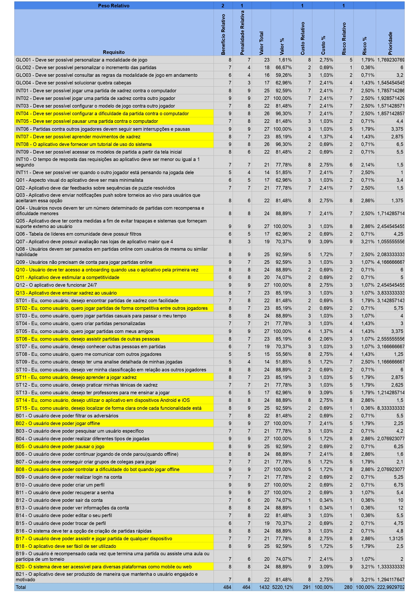

# Priorização

## Introdução

O principal objetivo das técnicas de priorização de requisitos é auxiliar na escolha das funções ou funcionalidade mais essenciais em um sistema em desenvolvimento, definindo estratégias e parâmetros capazes de fornecer um resultado mais apropriado para cada tipo de problema. Essa prática é de relevante importância em um cenário em que as expectativas do cliente são altas, os prazos são curtos e os recursos são limitados. Para definir as prioridades de cada requisito foram utilizadas duas técnicas: MoSCow, escala de três níveis, _first things first_(FTF).

### Técnicas Utilizadas

A priorização dos requisitos foi feita por meio das seguintes técnicas:

- [MosCoW](./#moscow)
- [First Things First (FTF)](./#first-things-first-ftf)
- [Escala de Três Níveis](./#escala-de-tres-niveis)

## MoSCoW

O método MoSCoW é uma técnica priorização de requisitos que pode ajudar o time de desenvolvimento no processo de tomada de decisão. Alguns dos objetivos dessa estrutura são:

> 1. Identificar o grau de prioridade das tarefas em um projeto.
> 2. Alinhar stakeholders sobre o que deve ser feito, de acordo com a ordem de importância dos elementos considerados.

### Metodologia - MoSCoW

Suas iniciais representam:

- **M**ust-Have
- **S**hould
- **Co**uld-Have
- **W**ould/Want/Won't-Have

### Must-Have

Correspondem às tarefas indispensáveis para a realização do projeto e que precisam ser priorizadas. Tudo que for considerado Must-Have é fundamental para o Produto. São iniciativas de alto impacto, que agregam valor ao produto e que, caso não sejam feitas, prejudicam a experiência do cliente. Essas demandas são as mais urgentes, e o time deve concentrar esforços para resolvê-las primeiro.

### Should-Have

Devem ser incluidos aqueles que são importante para a realização do projeto, mas não fundamentais, como as atividades Must-Have.

### Could-Have

São menos importantes que requisitos should-have. Agregam valor ao projeto, mas sua ausência não impacta significantemente

### Would/Want/Won't-Have

São aqueles que não tem importância significativa para o projeto. A presença ou ausência desses requisitos não tem impacto na conclusão satisfatória do projeto.

Na _tabela 1_ estão identificados os requisitos elicitados respectivamente priorizados:

| Identificador | Requisito                                                                                                      | Priorização |
| :-----------: | -------------------------------------------------------------------------------------------------------------- | :---------: |
|     GLO01     | Deve ser possível personalizar a modalidade de jogo                                                            |    Could    |
|     GLO02     | Deve ser possível personalizar o incremento das partidas                                                       |    Would    |
|     GLO03     | Deve ser possível consultar as regras da modalidade de jogo em andamento                                       |    Could    |
|     GLO04     | Deve ser possível solucionar quebra cabeças                                                                    |    Could    |
|     INT01     | Deve ser possível jogar uma partida de xadrez contra o computador                                              |    Must     |
|     INT02     | Deve ser possível jogar uma partida de xadrez contra outro jogador                                             |    Must     |
|     INT03     | Deve ser possível configurar o modelo de jogo contra outro jogador                                             |   Should    |
|     INT04     | Deve ser possível configurar a dificuldade da partida contra o computador                                      |    Must     |
|     INT05     | Deve ser possível pausar uma partida contra o computador                                                       |    Must     |
|     INT06     | Partidas contra outros jogadores devem seguir sem interrupções e pausas                                        |    Must     |
|     INT07     | Deve ser possível aprender movimentos de xadrez                                                                |   Should    |
|     INT08     | O aplicativo deve fornecer um tutorial de uso do sistema                                                       |   Should    |
|     INT09     | Deve ser possível acessar os modelos de partida a partir da tela inicial                                       |   Should    |
|     INT10     | O tempo de resposta das requisições ao aplicativo deve ser menor ou igual a 1 segundo                          |    Would    |
|     INT11     | Deve ser possível ver quando o outro jogador está pensando na jogada dele                                      |    Would    |
|      Q01      | Aspecto visual do aplicativo deve ser mais minimalista                                                         |    Could    |
|      Q02      | Aplicativo deve dar feedbacks sobre sequências de puzzle resolvidos                                            |    Would    |
|      Q03      | Aplicativo deve enviar notificações push sobre torneios ao vivo para usuários que aceitaram essa opção         |    Could    |
|      Q04      | Usuários novos devem ter um número determinado de partidas com recompensa e dificuldade menores                |    Would    |
|      Q05      | Aplicativo deve ter contra medidas a fim de evitar trapaças e sistemas que forneçam suporte externo ao usuário |    Must     |
|      Q06      | Tabela de líderes em comunidade deve possuir filtros                                                           |    Would    |
|      Q07      | Aplicativo deve possuir avaliação nas lojas de aplicativo maior que 4                                          |    Could    |
|      Q08      | Usuários devem ser pareados em partidas online com usuários de mesma ou similar habilidade                     |   Should    |
|      Q09      | Usuários não precisam de conta para jogar partidas online                                                      |    Could    |
|      Q10      | Usuário deve ter acesso a onboarding quando usa o aplicativo pela primeira vez                                 |    Must     |
|      Q11      | Aplicativo deve estimular a competitividade                                                                    |    Could    |
|      Q12      | O aplicativo deve funcionar 24/7                                                                               |    Must     |
|      Q13      | Aplicativo deve ensinar xadrez ao usuário                                                                      |    Must     |
|     ST01      | Eu, como usuário, desejo encontrar partidas de xadrez com facilidade                                           |    Must     |
|     ST02      | Eu, como usuário, quero jogar partidas de forma competitiva entre outros jogadores                             |    Must     |
|     ST03      | Eu, como usuário, quero jogar partidas casuais para passar o meu tempo                                         |    Must     |
|     ST04      | Eu, como usuário, quero criar partidas personalizadas                                                          |    Must     |
|     ST05      | Eu, como usuário, quero jogar partidas com meus amigos                                                         |    Must     |
|     ST06      | Eu, como usuário, desejo assistir partidas de outras pessoas                                                   |   Should    |
|     ST07      | Eu, como usuário, desejo conhecer outras pessoas em partidas                                                   |    Would    |
|     ST08      | Eu, como usuário, quero me comunicar com outros jogadores                                                      |    Could    |
|     ST09      | Eu, como usuário, desejo ter uma analise detalhada de minhas jogadas                                           |    Would    |
|     ST10      | Eu, como usuário, desejo ver minha classificação em relação aos outros jogadores                               |    Must     |
|     ST11      | Eu, como usuário, desejo aprender a jogar xadrez                                                               |   Should    |
|     ST12      | Eu, como usuário, desejo praticar minhas ténicas de xadrez                                                     |    Could    |
|     ST13      | Eu, como usuário, desejo ter professores para me ensinar a jogar                                               |    Could    |
|     ST14      | Eu, como usuário, desejo utilizar o aplicativo em dispositivos Android e iOS                                   |   Should    |
|     ST15      | Eu, como usuário, desejo localizar de forma clara onde cada funcionalidade está                                |    Must     |
|      B01      | O usuário deve poder filtrar os adversários                                                                    |   Should    |
|      B02      | O usuário deve poder jogar offline                                                                             |    Must     |
|      B03      | O usuário deve poder pesquisar um usuário específico                                                           |    Could    |
|      B04      | O usuário deve poder realizar diferentes tipos de jogadas                                                      |    Must     |
|      B05      | O usuário deve poder pausar o jogo                                                                             |    Must     |
|      B06      | O usuário deve poder continuar jogando de onde parou(quando offline)                                           |    Must     |
|      B07      | O usuário deve conseguir criar grupos de colegas para jogar                                                    |    Could    |
|      B08      | O usuário deve poder controlar a dificuldade do bot quando jogar offline                                       |    Must     |
|      B09      | O usuário deve poder realizar login na conta                                                                   |   Should    |
|      B10      | O usuário deve poder criar um perfil                                                                           |   Should    |
|      B11      | O usuário deve poder recuperar a senha                                                                         |    Must     |
|      B12      | O usuário deve poder sair da conta                                                                             |    Must     |
|      B13      | O usuário deve poder ver informações da conta                                                                  |   Should    |
|      B14      | O usuário deve poder editar o seu perfil                                                                       |   Should    |
|      B15      | O usuário deve poder trocar de perfil                                                                          |   Should    |
|      B16      | O sistema deve ter a opção de criação de partidas rápidas                                                      |    Must     |
|      B17      | O usuário deve poder assistir e jogar partida de qualquer dispositivo                                          |   Should    |
|      B18      | O aplicativo deve ser fácil de ser utilizado                                                                   |    Must     |
|      B19      | O usuário é recompensado cada vez que termina uma partida ou assiste uma aula ou participa de um torneio       |    Could    |
|      B20      | O sistema deve ser acessível para diversas plataformas como mobile ou web                                      |   Should    |
|      B21      | O aplicativo deve ser produzido de maneira que mantenha o usuário engajado e motivado                          |    Must     |

<figcaption>Tabela 1: Tabela de priorização MoSCoW.</figcaption>
 

## First Things First (FTF)

First Things First é uma técnica de priorização em que um levantamento de dados de benefícios, custos e riscos relacionados a cada requisito são levantados. Assim como a técnica MoSCoW, ela é utilizada para criar uma ordem de prioridades dos requisitos a serem implementados.

### Metodologia - FTF

Para a respectiva técnica de priorização é apresentada, em forma de tabela, os riscos, custos, benefícios e a penalidade relativa de cada requisito elicitado para o projeto, além de equilibrar os posicionamentos do cliente e do desenvolvedor.

Segue o esquema:

> 1. Listar todos os requisitos em uma tabela, retirando aqueles dependentes de outro requisito.
> 2. Estimar o benefício relativo que cada recurso fornece ao cliente ou ao negócio de 1 a 9, em que 1 é o menos significativo e 9 o mais significativo.
> 3. Estimar a penalidade que o negócio sofreria, se o recurso não fosse incluído, de 1 a 9, em que 1 é o com menor penalidade e 9 maior penalidade.
> 4. A Coluna valor total é a soma do (Benefício Relativo _Peso Relativo + Penalidade Relativa_ \* _Peso Relativo_), o peso relativo utilizado nesse caso foi de 1.
> 5. Estimar o custo relativo de implementação de cada requisito, de 1 a 9.
> 6. Estimar o grau relativo ao risco a cada requisito de uma escala de 1 a 9.
> 7. Calcular a prioridade para cada requisito usando: valor % / (custo % _Peso custo + risco %_ Peso Risco). O Peso custo e risco aqui utilizados foram iguais a 1.
> 8. Ordenar a lista em ordem decrescente de prioridade.

Na _tabela 2_ é possível validar o esquema construído pelo grupo:

<figcaption>Tabela 2: Esquema First Things First.</figcaption>
 

## Escala de três níveis

### Metodologia

Prática comum de agrupamento de requisitos em três categorias, geralmente são: alta, média e baixa prioridade. Somente isso gera uma priorização subjetiva. A identificação dos _stakeholders_ sobre o que cada prioridade significa em termos de ação no projeto. 
Uma forma prática é dimensionar as prioridades com base em importância e urgência. Importância confere o quanto o requisito em análise contribui para um objetivo de negócio da empresa. Urgência é relativa a necessidade que certo requisito precisa estar disponível.

Com isso são criados 4 quadrantes onde um requisito se encaixa:

- Alta prioridade: Alta importância e alta urgência (clientes precisam desse requisito na próxima entrega).
- Média prioridade: Alta importância e baixa prioridade (clientes podem esperar esse requisito em uma próxima entrega).
- Baixa prioridade: Baixa importância e baixa prioridade (clientes podem vivem ser esse requisito se necessário).
- Requisitos podem aparecer como urgente para certos _stakeholders_ porém não tem uma praticidade em atingir objetivos de negócio. Esses requisitos não devem ser executados.

## Priorização de Requisitos via Escala e Três Níveis

Abaixo temos a tabela de relação de requisitos. As prioridades foram estabelecidas com base nas personas identificadas no [artefato de personas](./personas.md). Nem todas personas se encaixam em certos requisitos, para isso foi criado um campo de justificativa para explicar a decisão de prioridade.

| Identificador | Requisito                                                                                                      |   Priorização    |                                                                                                                            Justificativa                                                                                                                            |
| :-----------: | -------------------------------------------------------------------------------------------------------------- | :--------------: | :-----------------------------------------------------------------------------------------------------------------------------------------------------------------------------------------------------------------------------------------------------------------: |
|     GLO01     | Deve ser possível personalizar a modalidade de jogo                                                            | Média Prioridade | Usuários experientes como o Ravi tendem a se desafiar de maneiras diferentes enquanto usuários casuais como a Robertam costumam experimentar diversos modos de jogo para se divertir. Existe grande valor agregado e torna o tempo de vida o sistema Lichess maior. |
|     GLO02     | Deve ser possível personalizar o incremento das partidas                                                       | Média Prioridade |                               Constitui elemento necessário para xadrez competitivoa, apesar de importante o ajuste no tempo total da partida supre a necessidade de incrementos. Dessa forma pode ser entregue em uma futura release                               |
|     GLO03     | Deve ser possível consultar as regras da modalidade de jogo em andamento                                       | Alta prioridade  |                                               Usuários casuais não detem o conhecimento de cada partida, saber as regras e ter acesso a ela durante as partidas permite que o usuário jogue diferente modos de jogo.                                                |
|     GLO04     | Deve ser possível solucionar quebra cabeças                                                                    | Média prioridade |                                                                                         Diferencial da plataforma Lichess que agrega um valor além das partidas de xadrez.                                                                                          |
|     INT01     | Deve ser possível jogar uma partida de xadrez contra o computador                                              | Alta prioridade  |                                                                                                  Usuários sem internet ainda conseguem utilizar o sistema Lichess                                                                                                   |
|     INT02     | Deve ser possível jogar uma partida de xadrez contra outro jogador                                             | Alta prioridade  |                                                                     Tanto jogadores competitivos quanto casuais usam o sistema como forma de encontrar outras pessoas reais para jogar contra.                                                                      |
|     INT03     | Deve ser possível configurar o modelo de jogo contra outro jogador                                             | Média Prioridade |                                                                        Usuários podem jogar partidas de xadrez comum enquanto esperam novas modalidades. Pode ser entregue em outra release.                                                                        |
|     INT04     | Deve ser possível configurar a dificuldade da partida contra o computador                                      | Alta Prioridade  |                                                                         O ajuste da dificuldade é um ponto importante para jogadores experientes e deve estar contida na primeira entrega.                                                                          |
|     INT05     | Deve ser possível pausar uma partida contra o computador                                                       | Baixa prioridade |                               Comportamento agrega pouco valor visto o tempo médio de partidas de xadrez ser pequeno. Usuários podem estabelecer um tempo de partida maior e o tempo perdido por ausência não afeta tanto o usuário.                                |
|     INT06     | Partidas contra outros jogadores devem seguir sem interrupções e pausas                                        | Baixa Prioridade |                                                        Sistema deve ter maneira de identificar possíveis pausas por parte de um ou ambos jogadores, logo a ausência de interrupções é de baixa importância.                                                         |
|     INT07     | Deve ser possível aprender movimentos de xadrez                                                                | Alta prioridade  |                                                                                               Jogadores casuais devem ter ferramentas para crescimento no aplicativo.                                                                                               |
|     INT08     | O aplicativo deve fornecer um tutorial de uso do sistema                                                       | Baixa prioridade |                                                                                      Sistema bem definifo proporcionará nomes e formas de interação intuitiva possibilitando.                                                                                       |
|     INT09     | Deve ser possível acessar os modelos de partida a partir da tela inicial                                       | Baixa prioridade |                                                              Navegação natural disso será inserido na parte criar uma partida. Logo esse fator é redundante podendo os usuários viver sem o requisito.                                                              |
|     INT10     | O tempo de resposta das requisições ao aplicativo deve ser menor ou igual a 1 segundo                          | Média Prioridade |                                          A performance do aplicativo apresenta circustâncias para além do sistema Lichess. Dessa forma, atividades performáticas em todos os dispositivos é importante porém não urgente.                                           |
|     INT11     | Deve ser possível ver quando o outro jogador está pensando na jogada dele                                      | Baixa Prioridade |                                                                                                                                                                                                                                                                     |
|      Q01      | Aspecto visual do aplicativo deve ser mais minimalista                                                         | Alta prioridade  |                                                                                           A poluição visual do sistema reduz drasticamente o tempo de sessão do usuário.                                                                                            |
|      Q02      | Aplicativo deve dar feedbacks sobre sequências de puzzle resolvidos                                            | Baixa prioridade |                                                                                                                                                                                                                                                                     |
|      Q03      | Aplicativo deve enviar notificações push sobre torneios ao vivo para usuários que aceitaram essa opção         | Baixa prioridade |                                                                                                  Usuários podem conferir status do torneio acessando o aplicativo.                                                                                                  |
|      Q04      | Usuários novos devem ter um número determinado de partidas com recompensa e dificuldade menores                | Baixa prioridade |                                    Isso funciona como um sistema de tutorial. Em caso de dificuldades o usuário pode acessar conteúdo para aprender sobre xadrez e assim melhorar sua habilidade. Jogadores podem viver sem isso                                    |
|      Q05      | Aplicativo deve ter contra medidas a fim de evitar trapaças e sistemas que forneçam suporte externo ao usuário | Média prioridade |                                                                                           Identificação de contra medidas deve ser feita após identificação de trapaças.                                                                                            |
|      Q06      | Tabela de líderes em comunidade deve possuir filtros                                                           | Baixa prioridade |                                                                                                                                                                                                                                                                     |
|      Q07      | Aplicativo deve possuir avaliação nas lojas de aplicativo maior que 4                                          | Alta prioridade  |                                                                                             Manter a nota do aplicativo acima de 4 beneficia o sistema de recomendação.                                                                                             |
|      Q08      | Usuários devem ser pareados em partidas online com usuários de mesma ou similar habilidade                     |      Should      |
|      Q09      | Usuários não precisam de conta para jogar partidas online.                                                     | Alta prioridade  |                                                                  Usuários devem acessar o app e conseguir exercer atividades. Impossibilitar isso é algo que irá gerar diversas reviews negativas.                                                                  |
|      Q10      | Usuário deve ter acesso a onboarding quando usa o aplicativo pela primeira vez                                 | Baixa prioridade |                                                                                        Sistema bem desenhado e intuitvo irá possibilitar usuários viver sem esse requisito.                                                                                         |
|      Q11      | Aplicativo deve estimular a competitividade                                                                    | Média prioridade |                                                                                               Estimular usuários competitivos irá melhorar a avaliação do aplicativo                                                                                                |
|      Q12      | O aplicativo deve funcionar 24/7                                                                               | Alta prioridade  |                                                                                                                                                                                                                                                                     |
|      Q13      | Aplicativo deve ensinar xadrez ao usuário                                                                      | Alta prioridade  |                                                                                                                                                                                                                                                                     |
|     ST01      | Eu, como usuário, desejo encontrar partidas de xadrez com facilidade                                           | Alta prioridade  |
|     ST02      | Eu, como usuário, quero jogar partidas de forma competitiva entre outros jogadores                             | Média prioridade |
|     ST03      | Eu, como usuário, quero jogar partidas casuais para passar o meu tempo                                         | Média prioridade |                                                                                                                                                                                                                                                                     |
|     ST04      | Eu, como usuário, quero criar partidas personalizadas                                                          | Média prioridade |                                                                                                                                                                                                                                                                     |
|     ST05      | Eu, como usuário, quero jogar partidas com meus amigos                                                         | Baixa prioridade |                                                                 Sistema para jogar com amigos não é a missão principal do Lichess e sim um objetivo secundário logo não é tão importante e urgente                                                                  |
|     ST06      | Eu, como usuário, desejo assistir partidas de outras pessoas                                                   | Baixa prioridade |                                                                                                                                                                                                                                                                     |
|     ST07      | Eu, como usuário, desejo conhecer outras pessoas em partidas                                                   | Alta prioridade  |                                                                                                                                                                                                                                                                     |
|     ST08      | Eu, como usuário, quero me comunicar com outros jogadores                                                      | Baixa prioridade |                                                                                                                                                                                                                                                                     |
|     ST09      | Eu, como usuário, desejo ter uma analise detalhada de minhas jogadas                                           | Baixa prioridade |                                                                                                                                                                                                                                                                     |
|     ST10      | Eu, como usuário, desejo ver minha classificação em relação aos outros jogadores                               | Média prioridade |                                                                                                                                                                                                                                                                     |
|     ST11      | Eu, como usuário, desejo aprender a jogar xadrez                                                               | Alta prioridade  |                                                                                                                                                                                                                                                                     |
|     ST12      | Eu, como usuário, desejo praticar minhas técnicas de xadrez                                                    | Média prioridade |
|     ST13      | Eu, como usuário, desejo ter professores para me ensinar a jogar                                               | Baixa prioridade |                                                                                                                                                                                                                                                                     |
|     ST14      | Eu, como usuário, desejo utilizar o aplicativo em dispositivos Android e iOS                                   | Alta prioridade  |                                                                                                                                                                                                                                                                     |
|     ST15      | Eu, como usuário, desejo localizar de forma clara onde cada funcionalidade está                                | Alta prioridade  |                                                                                                                                                                                                                                                                     |
|      B01      | O usuário deve poder filtrar os adversários                                                                    | Baixa prioridade |                                                                                                                                                                                                                                                                     |
|      B02      | O usuário deve poder jogar offline                                                                             | Alta prioridade  |                                                                                                                                                                                                                                                                     |
|      B03      | O usuário deve poder pesquisar um usuário específico                                                           | Alta prioridade  |                                                                                                                                                                                                                                                                     |
|      B04      | O usuário deve poder realizar diferentes tipos de jogadas                                                      | Alta prioridade  |                                                                                                                                                                                                                                                                     |
|      B05      | O usuário deve poder pausar o jogo                                                                             | Baixa prioridade |                                                                                                                                                                                                                                                                     |
|      B06      | O usuário deve poder continuar jogando de onde parou(quando offline)                                           | Baixa prioridade |                                                                                                                                                                                                                                                                     |
|      B07      | O usuário deve conseguir criar grupos de colegas para jogar                                                    | Baixa prioridade |                                                                                                                                                                                                                                                                     |
|      B08      | O usuário deve poder controlar a dificuldade do bot quando jogar offline                                       | Média prioridade |                                                                                                                                                                                                                                                                     |
|      B09      | O usuário deve poder realizar login na conta                                                                   | Alta prioridade  |                                                                                                                                                                                                                                                                     |
|      B10      | O usuário deve poder criar um perfil                                                                           | Alta prioridade  |                                                                                                                                                                                                                                                                     |
|      B11      | O usuário deve poder recuperar a senha                                                                         | Alta prioridade  |                                                                                                                                                                                                                                                                     |
|      B12      | O usuário deve poder sair da conta                                                                             | Alta prioridade  |                                                                                                                                                                                                                                                                     |
|      B13      | O usuário deve poder ver informações da conta                                                                  | Baixa prioridade |                                                                                                                                                                                                                                                                     |
|      B14      | O usuário deve poder editar o seu perfil                                                                       | Alta prioridade  |                                                                                                                                                                                                                                                                     |
|      B15      | O usuário deve poder trocar de perfil                                                                          | Alta prioridade  |                                                                                                                                                                                                                                                                     |
|      B16      | O sistema deve ter a opção de criação de partidas rápidas                                                      | Alta prioridade  |                                                                                                                                                                                                                                                                     |
|      B17      | O usuário deve poder assistir e jogar partida de qualquer dispositivo                                          | Baixa prioridade |                                                                                                                                                                                                                                                                     |
|      B18      | O aplicativo deve ser fácil de ser utilizado                                                                   | Alta prioridade  |                                                                                                                                                                                                                                                                     |
|      B19      | O usuário é recompensado cada vez que termina uma partida ou assiste uma aula ou participa de um torneio       | Baixa prioridade |                                                                                                                                                                                                                                                                     |
|      B20      | O sistema deve ser acessível para diversas plataformas como mobile ou web                                      | Alta prioridade  |                                                                                                                                                                                                                                                                     |
|      B21      | O aplicativo deve ser produzido de maneira que mantenha o usuário engajado e motivado                          | Média prioridade |                                                                                                                                                                                                                                                                     |

## 3. Bibliografia

[1] WIEGERS Karl E. First Things First: Prioritizing Requirements. Setembro de 1999. Disponível no [link](https://www.processimpact.com/articles/prioritizing.pdf)

## Histórico de Versão

| Versão | Data       | Descrição                                                 | Autor(es)        | Revisor(es)  |
| ------ | ---------- | --------------------------------------------------------- | ---------------- | ------------ |
| `1.0`  | 29/11/2022 | Criação do documento de priorização de requisitos         | Renan            | Lucas Macedo |
| `2.0`  | 19/01/2023 | Adição de técnica de priorização de escala de três níveis | Mauricio Machado | Lucas Macedo |
