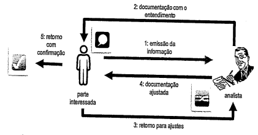

# Planejamento da Elicitação de Requisitos

## Introdução

A principal atividade relacionada à engenharia de requisitos é a **elicitação** destes. Essa etapa é extremamente desafiadora, principalmente por depender fortemente de recursos humanos. O processo de elicitação é um processo analítico e colaborativo que envolve as atividades de coleta, descoberta, extração e definição de requisitos, funcionais e não funcionais.

Requisitos bem elicitados facilitam a comunicação entre o time de desenvolvimento e os _stakeholders_ (todas as partes interessadas no projeto), e uma vez que os desenvolvedores possuem uma visão clara sobre os requisitos, estes também podem propor soluções de acordo com as possibilidades e restrições existentes. O processo de requisitos é cíclico, passando pelas etapas de **elicitação**, **análise** e **especificação** de forma iterativa ao longo do desenvolvimento do produto. O presente documento visa explicar, brevemente, algumas técnicas de elicitação, dentre as quais foram selecionadas técnicas para o desenvolvimento do projeto.

## Técnicas de Elicitação

Independentemente da técnica escolhida, para fazer uma boa elicitação de requisitos é importante que o engenheiro de requisitos tente entender os processos e decisões envolvidas no trabalho do usuário, pois estas fornecem uma boa direção para o processo de elicitação. Além disso, o projetista deve ter em mente que ao tratar com recursos humanos é essencial manter uma boa comunicação, clara e transparente, e com vocabulário condizente com os interlocutores, ou seja, é recomendável evitar jargões técnicos. Os clientes devem entender que as discussões sobre funcionalidades não irão, necessariamente, agregar funcionalidades ao produto, para desta forma poderem falar mais livremente sobre suas visões do produto e dos requisitos.

Todas as técnicas de elicitação englobam uma fase de preparação, durante a qual são definidos o escopo da elicitação e é feita a preparação dos recursos. A seguir, as atividades planejadas são executadas, e os resultados obtidos são organizados e documentados. Por fim, é fundamental que seja feita uma confirmação dos resultados obtidos com os _stakeholders_, o que pode ser feito por meio do Protocolo do Garçom, ilustrado na Figura 1.

 Figura 1: Protocolo do Garçom. Fonte: <a href="#bibliografia">[2]</a> 

## Definição das técnicas

É importante utilizar mais de uma técnica de elicitação, pois estas podem apresentar resultados e engajamento diferentes em diferentes grupos de _stakeholders_. Trabalhar diretamente com usuários é necessário, já que os requisitos estão intimamente relacionados às atividades que serão desempenhadas por eles.

Após estudar as técnicas, e levando em consideração o acesso aos usuários, disponibilidade de tempo e afinidade de cada membro, foram definidas as técnicas de elicitação de requisitos para o projeto. Abaixo estão elencadas as técnicas escolhidas.

- [Brainstorming](./brainstorming.md)
- [Storytelling](./storytelling.md)
- [Personas](./personas.md)
- [Questionário](./questionario.md)
- [Glossário](./glossario.md)
- [Introspecção](./introspeccao.md)

## Planejamento

Para fazer a elicitação e priorização dos requisitos, apoiando-se nos usuários, personas e estudos sobre as técnicas, foi elaborado o cronograma representado na Tabela 1.

| Técnica | Autor | Revisor | Data limite  | Data limite da revisão |
| - | - | - | - | - |
| StoryTelling | Lucas Macedo | Nicolas | 25/11/2022 | 26/11/2022 |
| Personas | Mauricio | Lucas Macedo | 24/11/2022 | 25/11/2022 |
| Questionário | Mauricio | Lucas Macedo | 24/11/2022 | 25/11/2022 |
| Introspecção | Nicolas | Davi | 27/11/2022 | 28/11/2022 |
| Glossário | Nicolas | Lucas Gabriel | 27/11/2022 | 28/11/2022 |
| Entrevista | Lucas Gabriel | Mauricio | 25/11/2022 | 26/11/2022 |
| Brainstorming | Davi Silva | Lucas Gabriel | 25/11/2022 | 26/11/2022 |
| Priorização  | Renan | Lucas Macedo | 28/11/2022 | 29/11/2022 |

 Tabela 1: Planejamento da elicitação e priorização de requisitos (fonte: autor, 2022). 

## Bibliografia

[1] WIEGERS K., BEATTY J. Software Requirements, 3ª edição.

[2] VAZQUEZ C., SIMÕES G. Engenharia de Requisitos, 1ª edição.

## Histórico de Versão

| Versão | Data          | Descrição                          | Autor(es)     |  Revisor(es)  |
| ------ | ------------- | ---------------------------------- | ------------- | ------------- |
| `1.0`  |  22/11/2022 |  Criação do documento | Nicolas Souza  | Maurício Machado |
| `1.1`  |  30/11/2022 |  Inclusão do cronograma de elicitação e priorização | Nicolas Souza  | Lucas Macedo |
