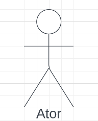
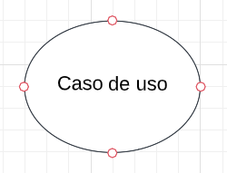

# Diagrama de Casos de Uso

## 1. Introdução

O diagrama de casos de uso é uma representação de como o sistema deve realizar no ponto de vista do usuário. De outra forma, ele descreve as principais funcionalidades do sistema e a interação com usuários.

## 2. Metodologia

Para a criação desse artefato foi utilizado a abordagem tradicional, ou seja, representação os casos de uso através de uma diagrama UML. A ferramenta utilizada para a criação do diagrama foi o [LucidChart](https://www.lucidchart.com/pages/pt), um software online para criação de diagramas.

## 3. Componentes e símbolos

Para a construção do diagrama, termos os seguintes elementos

### 3.1 Atores

São os usuários do sistema, normalmente são representados por bonecos palitos. Pode ser visualizado na *Figura 1*.

 Figura 1: Ator (Fonte: autor, 2022).

### 3.2 Cenário

Sequência de eventos que acontecem quando um usuário interage com o sistema. Geralmente definido como caixa. Todos os casos de uso fora da caixa são considerados fora do escopo do sistema. Pode ser visualizado na *Figura 2*.

 Figura 2: Cenário (Fonte: autor, 2022).

### 3.3 Casos de uso

Casos de uso é uma atividade ou funcionalidade realizada pelo usuário. Geralmente são definidos na forma oval horizontal, onde cada forma é um uso diferente que o usuário pode ter. Pode ser visualizado na *Figura 3*.

 Figura 3: Caso de uso (Fonte: autor, 2022).

### 3.4 Comunicação (ou ação)

Como o verbo já diz, é a ação que comunica o usuário ao caso de uso, e pode ser visualizada na *Figura 4*. Para melhorar o entendimento, a ação pode ser definidas de duas formas, sendo elas:

* **Inclusão:** Relação em que um caso de uso quando precisa ter sua funcionalidade executada através de outro caso de uso. Em outras palavras, quando um caso de uso A inclui um caso de uso B, onde quando o caso de uso A ser executado, o caso de uso B necessariamente será executado também

* **Extensão:** Já a extensão significa que o caso de uso atual irá funcionar normalmente, porem alguns serão adicionados novos passos no caso de uso estendido. Ou seja, quando o caso de uso A ser executado, ele poderá (ou não) ser executado também.

 Figura 4: Cenário (Fonte: autor, 2022).

## 4. Diagrama UML

 Figura 5: Diagrama de uso (Fonte: autor, 2022).

## Bibliografia

[1] DevMedia. O que é UML e Diagramas de Caso de Uso: Introdução Prática à UML. 2012. DevMedia. Disponível em: <https://www.devmedia.com.br/o-que-e-uml-e-diagramas-de-caso-de-uso-introducao-pratica-a-uml/23408>. Acessado em 07 de dez. de 2022.

[2] IBM. Diagramas de Caso de Uso.IBM. Disponível em: <https://www.ibm.com/docs/pt-br/rsm/7.5.0?topic=diagrams-use-case>. Acessado em 07 de dez. de 2022

[3] Ferramenta Lucidchart, disponível no [link](https://www.lucidchart.com/pages/pt). Acessado em 07 de dez. de 2022.

## Histórico de Versão

| Versão | Data          | Descrição                          | Autor(es)     |  Revisor(es)  |
| ------ | ------------- | ---------------------------------- | ------------- | ------------- |
| `1.0`  |        07/12/2022       |        Criação inicial do documento                            |     Lucas Macedo          |  Nicolas Souza       |
