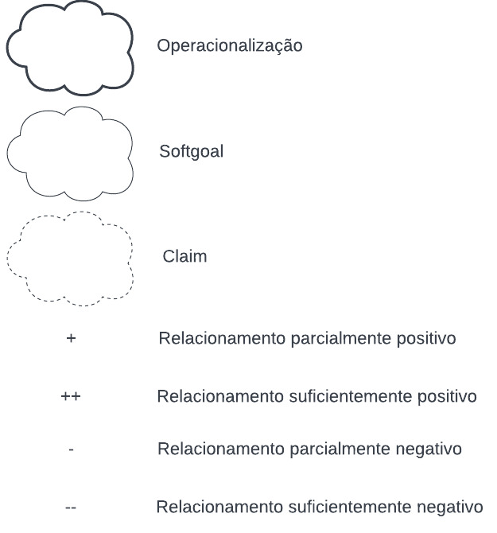
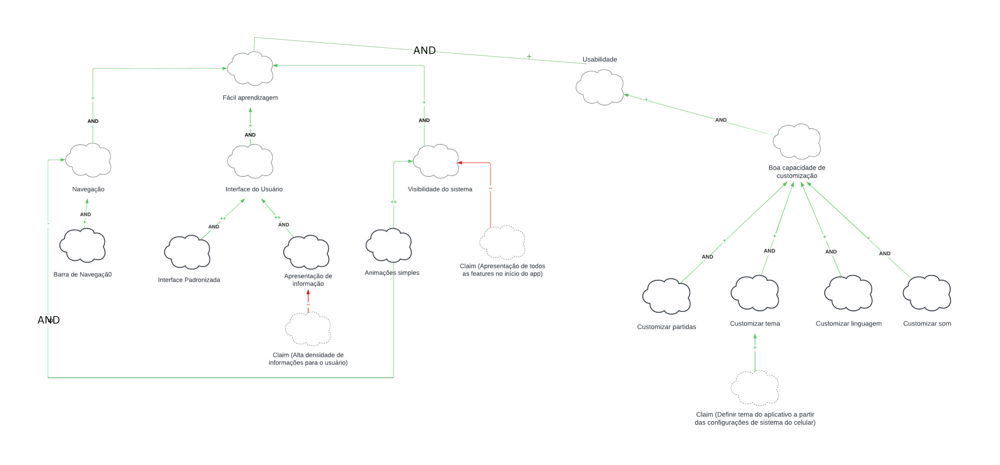
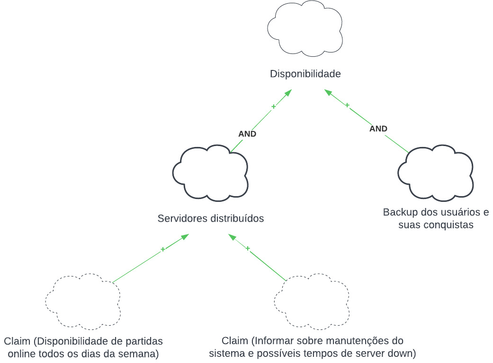
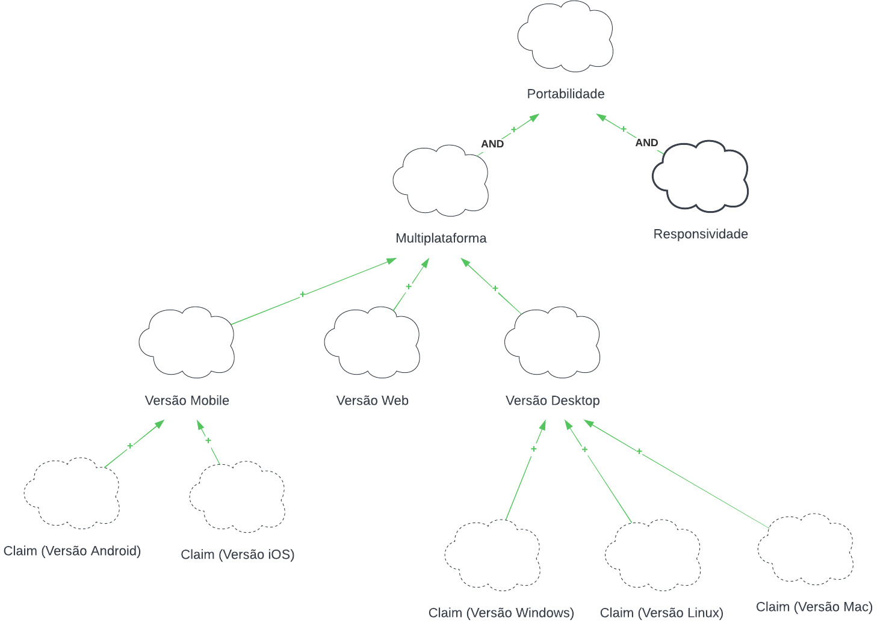
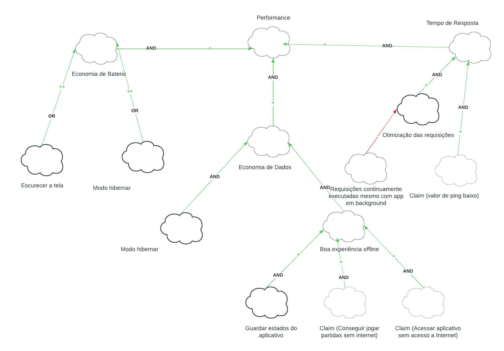

# NFR Framework

O NFR Framework é uma abordagem para representar e analisar Requisitos Não-Funcionais. Seu objetivo é ajudar desenvolvedores na implementação de soluções personalizadas, levando em consideração as características do domínio e dos sistema em questão.

O Framework utiliza de softgoals, um objetivo que não possui uma clara definição nem critérios de satisfação precisos. São utilizados para representar Requisitos Não-Funcionais e podem estar inter-relacionados, expressando a influência de uma softgoal em outro.

É representado por meio de um grafo, chamado Softgoal Interdependency Graph (SIG), que registra as considerações do desenvolvedor sobre os softgoals e mostra suas interdependências.

Os softgoals podem ser separados em 3 tipos:

- NFR Softgoal – Característica abstrata, a qual se deseja considerar na análise, visando saber se a mesma será cumprida ou não cumprida, ou seja, escolhida ou não escolhida para ser implementada. São requisitos não funcionais, vistos como critérios/atributos de qualidade.

- Softgoal de Operacionalização – forma concreta de viabilizar ou não as características abstratas. São funcionalidades.

- Claim Softgoal (Argumentation) – a notação que pode ser acrescentada ao modelo, argumentando algo sobre um ponto específico da modelagem. Escrita em linguagem natural.

Cada um desses Softgoals podem ser decompostos, e os tipos de decomposição são:

- Decomposição de Softgoal NFR: refina ou subdivide um um softgoal NFR em outros específicos. Isso pode ajudar a dividir grandes problemas em problemas menores e oferece um aspecto útil para lidar com ambiguidades e prioridades.

- Decomposição de Operacionalização: subdivide um softgoal de operacionalização em outros softgoals de operacionalização mais específicos. Operacionalizações são úteis para definir uma solução geral e refiná-la em soluções mais específicas.

- Decomposição de Afirmação (Claims): refina um softgoal de afirmação em outros softgoals de afirmação. Ela é importante para apoiar ou negar justificativas específicas de projeto.

- Priorização: A priorização é um tipo especial de decomposição, onde ocorre o refinamento de um softgoal em outro softgoal com o mesmo tipo e tópicos, mas com uma prioridade associada.

As decomposições são especificações dos softgoals, ou seja, alterações no estado de um softgoal filho geram alterações no softgoal pai, e essas alterações são chamadas de contribuições. Essas contribuições são:

| Contribuição | Descrição                                                                                                                                                   |
| ------------ | ----------------------------------------------------------------------------------------------------------------------------------------------------------- |
| AND          | se os softgoals descendentes forem satisfeitos os softgoals ascendentes também são.                                                                         |
| OR           | se algum softgoal descendente form satisfeito, o ascendente é satisfeito.                                                                                   |
| MAKE(++)     | se o softgoal descendente for satisfeito o softgoal pai também é.                                                                                           |
| BREAK(--)    | se o softgoal descendente for suficientemente satisfeito, o softgoal pai é negado.                                                                          |
| HELP(+)      | se o softgoal descendente for parcialmente satisfeito, o softgoal ascendente será parcialmente satisfeito.                                                  |
| HURT(-)      | se o softgoal descendente for satisfeito, o softgoal ascendente será parcialmente negado.                                                                   |
| UNKNOWN(?)   | fornece uma contribuição desconhecida entre um softgoal descendente e um ascendente, e pode ser tanto positiva quanto negativa.                             |
| EQUALS       | o softgoal descendente só será satisfeito se o softgoal ascendente for satisfeito / o softgoal descendente será negado se o softgoal ascendente for negado. |
| SOME (+\|-)  | usado se o sinal da contribuição é conhecido, mas a extensão(parcial ou total) não é.                                                                       |

Por fim, para a análise dos softgoals, são atribuídos rótulos que definem o grau de satisfação de um softgoal. Ao atribuir um rótulo em um softgoal de baixo nível, é feita a propagação da satisfação daquele requisito de acordo com as contribuições definidas.

## NFRs

A seguir estão apontados 4 NFRs que fizemos o rastreio e estudo mais profundo. Eles são: **usabilidade, disponibilidade, portabilidade, performance**.

### Legenda

A figura 1 apresenta a legenda dos diagramas NFRs que serão mencionados no restante do texto.

 Figura 1: Legenda NFR. (Fonte: autor, 2022).

### NFR Usabilidade

Na figura 2 temos o diagrama representando o NFR de usabilidade.

 Figura 2: Diagrama NFR Usabilidade. (Fonte: autor, 2022).

### NFR Disponibilidade

Na figura 3 temos o diagrama representando o NFR de disponibilidade.

 Figura 3: Diagrama NFR Disponibilidade. (Fonte: autor, 2022).

### NFR Portabilidade

Na figura 4 temos o diagrama representando o NFR de portabilidade.

 Figura 4: Diagrama NFR Portabilidade. (Fonte: autor, 2022).

### NFR Performance

Na figura 5 temos o diagrama representando o NFR de performance.

 Figura 5: Diagrama NFR Performance. (Fonte: autor, 2022).

## Requisitos elicitados através do NFR

Abaixo temos uma tabela referente aos requisitos não funcionais levantados através do NFR.

| ID | Requisito |
| :-----: | :-------------------------------------------------------------------------------------------: | | |
| RNFR01 | Sistema deve ter barra de navegação que siga padrões de UI/UX bem estabelecidos no mercado |
| RNFR02 | Usuário deve conseguir padronizar sua interface de maneira única |
| RNFR03 | Sistema deve ter no máximo 5 interações por funcionalidade |
| RNFR04 | Sistema deve ter animações simples de no máximo 300 milésimos |
| RNFR05 | Sistema deve apresentar acesso a todas as funcionalidades logo no início do app |
| RNFR07 | Sistema deve permitir customização de tema (claro e escuro) |
| RNFR08 | Sistema deve permitir customização de linguagem (português, inglês e espanhol) |
| RNFR09 | Sistema deve permitir customização de som (habilitar e desabilitar efeitos sonoros) |
| RNFR10 | Sistema deve estar online todos os dias da semana, durante todo o dia |
| RNFR11 | Sistema deve informar sobre manutenções e possíveis tempos em que o servidor estará offline via notificação |
| RNFR12 | Sistema deve realizar backup automático dos dados do usuário todo dia em horário com menor acesso (a ser determinado pelo sistema) |
| RNFR13 | Sistema deve ser compatível com Android (de versão 9.0 até atual) |
| RNFR14 | Sistema deve ser compatível com iOS (de versão 12 até atual) |
| RNFR17 | Sistema deve ser disponível na Web |
| RNFR18 | Sistema deve ser responsivo |
| RNFR19 | Sistema deve escurecer a tela em caso de inatividade maior de X minutos definido pelo usuário |
| RNFR2O | Dispositivo deve bloquear tela em caso de inatividadde prolongada |
| RNFR21 | Sistema deve guardar a última tela em que o usuário está |
| RNFR22 | Sistema deve permitir jogar partidas mesmo sem conexão de internet |
| RNFR23 | Sistema deve permitir acessar o aplicativo mesmo sem conexão de internet |
| RNFR 24 | Sistema deve ter uma taxa de atraso abaixa de 100 milisegundos |

 Tabela 1: Requisitos de NFR. (Fonte: autor, 2022).

## Bibliografia

[1] SILVA, Reinaldo. **NFR4ES: Um Catálogo de Requisitos Não-Funcionais para Sistemas Embarcados.**

[2] SERRANO, Milene - SERRANO, Maurício. Requisitos - Aula 17. Local: UnB-FGA, Gama, DF. Disponível em: [Requisitos - Aula 16](https://aprender3.unb.br/mod/resource/view.php?id=861032). Acesso em: 10 de Dezembro de 2022.

## Histórico de Versão

| Versão | Data       | Descrição                              | Autor(es)        | Revisor(es)   |
| ------ | ---------- | -------------------------------------- | ---------------- | ------------- |
| `1.0`  | 10/12/2022 | Criação da versão inicial do documento | Maurício Machado | Nicolas Souza |
| `1.1`  | 26/01/2023 | Adição lista de requisitos elicitados  | Maurício Machado | Nicolas Souza |
| `1.2`  | 26/01/2023 | Ajustes solicitados                    | Maurício Machado | Nicolas Souza |
