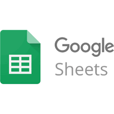
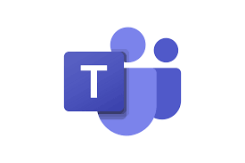

# Ferramentas

## Introdução

As ferramentas serão softwares utilizados pela equipe para facilitar o gerenciamento, comunicação e desenvolvimento da documentação necessária para a realização do projeto da disciplina. Projeto esse que o foco será a análise de requisitos do aplicativo Lichess.

## Ferramentas utilizadas

| Logo | Ferramenta | Finalidade |
| :-----: | :----: | ----------- |
|  | Github  | Utilizado como repositório dos documentos produzidos e para o versionamento dos mesmos.  |
|  | Telegram | Foi o software escolhido como o sistema de mensagens possibilitando uma comunicação mais ágil e constante do grupo. |
|   |  Google Planilhas  | Utilizado para construir o cronograma das atividades |
|  |  Microsoft teams  | Nas apresentações dos pontos de controle foi utilizado para compartilhar a tela com a github pages, gravar a apresentação o projeto e elaboração dos artefatos do projeto |
|  | Youtube | Utilizado para hospedar as gravações do projeto. |
|  | Visual Studio Code  | Utilizado para manipulação dos arquivos do projeto, devido facilidade de integração de extensões e da experiência da maioria dos integrantes com essa ferramenta. |
|    |  Miro  | Utilizado para a criação dos artefatos rich picture |
|  | Lucidchart | Utilizado para elaboração de diagramas.  |
|  | This Person Doesn't Exist | Utilizado para geração de imagens para as personas. |
|  | Miro | Utilizado para enviar o formulário e criar o perfil de usuário |

Tabela 1: Ferramentas utilizadas no projeto (Fonte: autor, 2022). 

## Bibliografia

[1] Ferramenta GitHub, disponível no [link](https://github.com).  
[2] Ferramenta Telegram, disponível no [link](https://telegram.org).  
[3] Ferramenta Google planilhas, disponível no [link](https://docs.google.com/sheets).  
[4] Ferramenta Microsoft Teams, disponível no [link](https://teams.microsoft.com).  
[5] Ferramenta Youtube, disponível no [link](https://youtube.com).  
[6] Ferramenta Visual Studio Code, disponível no [link](https://code.visualstudio.com).  
[7] Ferramenta Miro, disponível no [link](https://miro.com).  
[8] Ferramenta Lucid Chart, disponível no [link](https://lucidchart.com).  
[9] Ferramenta This Person Doesn't Exist, disponível no [link](https://thispersondoesnotexist.com/).  
[10] Ferramenta Google forms, disponível no [link](https://docs.google/forms).  
[11] Wiki Requisitos - Planejamento - Ferramentas. Disponível em: <https://requisitos-de-software.github.io/2022.1-TikTok/ferramentas/>. Acesso em: 16 de novembro de 2022.  

## Histórico de Versão

| Versão | Data    | Descrição                 | Autor(es)     |  Revisor(es)  |
| :-: | :-: | :-: | :-: | :-: |
| `1.0` | 16/11/2022 | Adição das ferramentas do projeto | Lucas Macedo | Nicolas e Lucas Gabriel |
| `1.1` | 30/11/2022 | Inclusão das ferramentas lucidchart e this person doesn't exist | Nicolas Souza  | Lucas Macedo  |
| `1.2` | 30/11/2022 | Inclusão da ferramenta Google Meet |  Lucas Macedo  | Nicolas Souza |
| `1.3` | 30/01/2023 | Remoção de ferramentas não utilizadas no projeto |  Lucas Macedo  | Nicolas Souza |
| `1.4` | 31/01/2023 | Inclusão dos links para as ferramentas na bibliografia | Nicolas Souza | Lucas Macedo |
